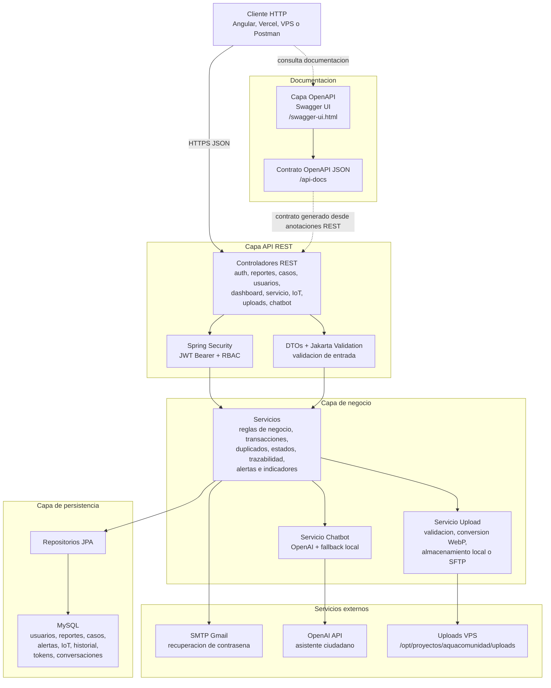

# AquaComunidad Backend

Backend REST de AquaComunidad para registrar reportes ciudadanos de agua, gestionar casos operativos, consultar trazabilidad, publicar alertas del servicio, monitorear niveles IoT, atender usuarios y servir el asistente ciudadano.

## Stack

| Tecnologia | Uso |
|---|---|
| Java 17 | Runtime principal |
| Spring Boot 4.0.6 | API REST, seguridad, validaciones y servicios |
| Spring Security + JWT | Autenticacion, autorizacion por roles y refresh token rotation |
| Spring Data JPA | Persistencia sobre MySQL |
| MySQL | Base de datos principal |
| Spring Mail | Recuperacion de contrasena por correo |
| OpenAI API | Respuestas del asistente ciudadano |
| JSch | Subida remota de archivos por SFTP cuando se despliega fuera del VPS |
| WebP/cwebp | Optimizacion de imagenes subidas |
| Springdoc OpenAPI | Documentacion Swagger |

## Modulos

```text
src/main/java/com/aquacomunidad/backend/
├── common/              # Enums y respuesta API estandar
├── config/              # Seguridad, CORS, OpenAPI y configuraciones web
├── exception/           # Excepciones y manejador global
├── security/            # Filtro JWT, contexto y respuestas 401/403
└── features/
    ├── autenticacion/   # Login, registro, refresh, logout y recuperacion
    ├── reporte/         # Reportes ciudadanos, filtros, resumen y trazabilidad
    ├── caso/            # Casos operativos y cambios de estado
    ├── historial/       # Auditoria de estados
    ├── usuario/         # Administracion de usuarios
    ├── servicio/        # Alertas del estado del servicio por zona
    ├── iot/             # Infraestructura hidrica, lecturas y alertas IoT
    ├── tablero/         # KPIs del panel administrativo y exportacion PDF
    ├── upload/          # Carga local o SFTP de imagenes optimizadas a WebP
    └── chatbot/         # Asistente ciudadano con fallback local
```

## Arquitectura por capas



OpenAPI se muestra como una capa separada porque no ejecuta reglas de negocio ni reemplaza a los controladores. Su responsabilidad es exponer el contrato de la API y permitir probar endpoints desde Swagger UI. Springdoc genera `/api-docs` leyendo los controladores, DTOs y anotaciones de Spring; Swagger UI consume ese JSON y lo presenta de forma interactiva.

## Requisitos

- Java 17
- Maven Wrapper incluido (`./mvnw`)
- MySQL 8 o compatible
- `cwebp` instalado si se ejecuta fuera de Docker y se van a subir imagenes

En Docker no es necesario instalar `cwebp` manualmente porque el `Dockerfile` instala el paquete `webp`.

## Configuracion local

1. Copia el archivo de ejemplo:

```bash
cp .env.example .env
```

2. Completa los valores locales en `.env`. No subas ese archivo al repositorio.

Variables principales:

| Variable | Descripcion |
|---|---|
| `DB_URL` | JDBC de MySQL |
| `DB_USERNAME` / `DB_PASSWORD` | Credenciales de base de datos |
| `APP_JWT_SECRETO` | Secreto JWT fuerte, minimo 64 caracteres recomendado |
| `APP_JWT_EXPIRACION_SEGUNDOS` | Duracion del access token |
| `APP_JWT_REFRESH_EXPIRACION_SEGUNDOS` | Duracion del refresh token |
| `CORS_ALLOWED_ORIGIN_PATTERNS` | Origenes permitidos para frontend, dominios y localhost |
| `MAIL_USERNAME` / `MAIL_APP_PASSWORD` | Credenciales SMTP |
| `OPENAI_API_KEY` / `OPENAI_MODEL` | Configuracion del asistente IA |
| `UPLOAD_STORAGE` | `local` o `sftp` |
| `UPLOAD_DIR` | Carpeta local de subida cuando `UPLOAD_STORAGE=local` |
| `UPLOAD_PUBLIC_BASE_URL` | URL publica usada para devolver imagenes |
| `WEBP_COMMAND` / `WEBP_QUALITY` | Comando y calidad de conversion WebP |
| `UPLOAD_SFTP_*` | Conexion SFTP para guardar archivos en el VPS desde nube externa |

## Base de datos

El esquema base esta en:

```text
src/main/resources/db/db_esquema.sql
```

Los indices de optimizacion estan en:

```text
src/main/resources/db/optimizacion_indices.sql
```

Las migraciones incrementales para los MVP 1/2/3 estan en:

```text
src/main/resources/db/migration/V2__mvp_alertas_iot_autoridad.sql
src/main/resources/db/migration/V3__seed_mvp_demo.sql
src/main/resources/db/migration/V4__seed_dashboard_reportes_demo.sql
```

Flyway se ejecuta al iniciar el backend y usa `baseline-on-migrate=true` para bases existentes sin historial previo. `V2` crea las tablas de estado del servicio, autoridad e IoT; `V3` carga datos demo de zonas, infraestructura, lecturas y alertas para presentar el MVP sin carga manual; `V4` inserta 50 ciudadanos demo y 120 reportes variados con casos e historial para alimentar el dashboard administrativo final.

Para aplicar manualmente en MySQL:

```bash
mysql -u usuario -p nombre_db < src/main/resources/db/db_esquema.sql
mysql -u usuario -p nombre_db < src/main/resources/db/optimizacion_indices.sql
```

Para una base existente creada con el esquema anterior, aplicar primero la migracion incremental:

```bash
mysql -u usuario -p nombre_db < src/main/resources/db/migration/V2__mvp_alertas_iot_autoridad.sql
mysql -u usuario -p nombre_db < src/main/resources/db/migration/V3__seed_mvp_demo.sql
mysql -u usuario -p nombre_db < src/main/resources/db/migration/V4__seed_dashboard_reportes_demo.sql
mysql -u usuario -p nombre_db < src/main/resources/db/optimizacion_indices.sql
```

## Ejecucion local

```bash
./mvnw spring-boot:run
```

La API queda disponible en:

```text
http://localhost:8080
```

Swagger/OpenAPI:

```text
http://localhost:8080/swagger-ui.html
http://localhost:8080/api-docs
```

## Docker

Construir imagen:

```bash
docker build -t aquacomunidad-backend .
```

Ejecutar contenedor:

```bash
docker run --rm -p 8080:8080 --env-file .env -v "$PWD/uploads:/app/uploads" aquacomunidad-backend
```

El contenedor expone `8080` por defecto. Tambien respeta `PORT` si la plataforma lo define.

## Uploads

El backend soporta dos modos:

| Modo | Uso recomendado |
|---|---|
| `UPLOAD_STORAGE=local` | VPS con volumen montado en `/app/uploads` |
| `UPLOAD_STORAGE=sftp` | Plataformas efimeras como Render, guardando imagenes en el VPS |

Toda imagen subida desde `/api/v1/uploads/reportes` o `/api/v1/uploads/casos` se valida, se convierte a WebP y se publica usando `UPLOAD_PUBLIC_BASE_URL`.

En VPS se recomienda:

```env
UPLOAD_STORAGE=local
UPLOAD_DIR=/app/uploads
UPLOAD_PUBLIC_BASE_URL=/uploads
```

En Render u otra nube externa se recomienda:

```env
UPLOAD_STORAGE=sftp
UPLOAD_SFTP_HOST=85.239.248.109
UPLOAD_SFTP_PORT=22
UPLOAD_SFTP_USER=aquaupload
UPLOAD_REMOTE_BASE_DIR=/opt/proyectos/aquacomunidad/uploads
UPLOAD_PUBLIC_BASE_URL=https://upload-aquacomunidad.proyectoutp.com/uploads
```

## Endpoints principales

| Modulo | Metodo | Endpoint |
|---|---:|---|
| Auth | POST | `/api/v1/auth/iniciarSesion` |
| Auth | POST | `/api/v1/auth/login` |
| Auth | POST | `/api/v1/auth/registrar` |
| Auth | POST | `/api/v1/auth/register` |
| Auth | POST | `/api/v1/auth/refresh` |
| Auth | POST | `/api/v1/auth/cerrarSesion` |
| Recuperacion | POST | `/api/v1/auth/recuperacion/solicitar-codigo` |
| Recuperacion | POST | `/api/v1/auth/recuperacion/confirmar-codigo` |
| Recuperacion | POST | `/api/v1/auth/recuperacion/restablecer-contrasena` |
| Reportes | POST | `/api/v1/reportes` |
| Reportes | GET | `/api/v1/reportes` |
| Reportes | GET | `/api/v1/reportes/mis-reportes` |
| Reportes | GET | `/api/v1/reportes/mis-reportes/resumen` |
| Reportes | GET | `/api/v1/reportes/mis-reportes/ultimo` |
| Reportes | GET | `/api/v1/reportes/mis-reportes/{id}` |
| Reportes | GET | `/api/v1/reportes/{id}/trazabilidad` |
| Casos | POST | `/api/v1/casos` |
| Casos | PATCH | `/api/v1/casos/{id}/estado` |
| Casos | GET | `/api/v1/casos` |
| Usuarios | POST | `/api/v1/usuarios` |
| Usuarios | GET | `/api/v1/usuarios` |
| Usuarios | PATCH | `/api/v1/usuarios/{id}/rol-estado` |
| Dashboard | GET | `/api/v1/dashboard/kpis` |
| Dashboard | GET | `/api/v1/dashboard/exportar-pdf` |
| Estado del servicio | GET | `/api/v1/estado-servicio/alertas` |
| Estado del servicio | POST | `/api/v1/estado-servicio/alertas` |
| IoT | GET | `/api/v1/iot/niveles` |
| IoT | POST | `/api/v1/iot/lecturas` |
| Uploads | POST | `/api/v1/uploads/reportes` |
| Uploads | POST | `/api/v1/uploads/casos` |
| Chatbot | POST | `/api/v1/chatbot/mensajes` |
| Chatbot | GET | `/api/v1/chatbot/conversaciones` |
| Chatbot | GET | `/api/v1/chatbot/conversaciones/{fechaConversacion}/mensajes` |

## Roles

| Rol | Permisos principales |
|---|---|
| `CIUDADANO` | Crear reportes, ver sus reportes, consultar trazabilidad propia y usar el asistente |
| `OPERADOR` | Ver reportes, crear/actualizar casos y consultar KPIs |
| `AUTORIDAD` | Consultar reportes, trazabilidad, dashboard, alertas del servicio y niveles IoT |
| `ADMIN` | Acceso operativo completo y gestion de usuarios |

## Pruebas

Ejecutar toda la suite:

```bash
./mvnw test
```

Ejecutar una prueba puntual:

```bash
./mvnw -Dtest=ChatbotServicioImplTest test
```

## Despliegue en VPS

El despliegue actual usa Docker Compose y Nginx externo como proxy HTTPS. La estructura esperada en el VPS es:

```text
/opt/proyectos/aquacomunidad/
├── backend/
├── frontend/
├── uploads/
├── .env
└── docker-compose.yml
```

Flujo recomendado:

```bash
cd /opt/proyectos/aquacomunidad/backend
git checkout dev
git pull --ff-only origin dev

cd /opt/proyectos/aquacomunidad/frontend
git checkout dev
git pull --ff-only origin dev

cd /opt/proyectos/aquacomunidad
docker compose up -d --build backend frontend
```

Validacion rapida:

```bash
curl -I https://aquacomunidad.proyectoutp.com/inicio
curl -s -H 'Content-Type: application/json' \
  -d '{"mensaje":"hola"}' \
  https://aquacomunidad.proyectoutp.com/api/v1/chatbot/mensajes
```

## Seguridad

- No versionar `.env`, llaves privadas, tokens ni contrasenas.
- Usar credenciales MySQL de minimo privilegio.
- Mantener `APP_JWT_SECRETO` distinto por entorno.
- Limitar CORS a dominios reales y localhost de desarrollo.
- En SFTP, usar usuario limitado sin permisos de shell administrativos.
