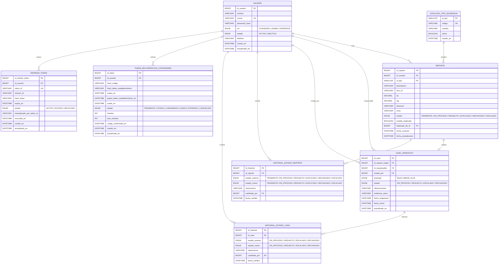
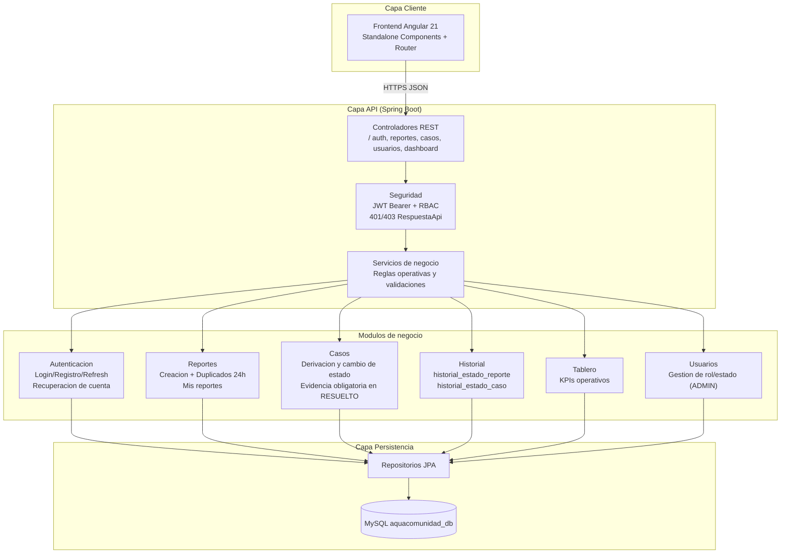

# AquaComunidad Backend

## 1. Descripcion del proyecto
Backend del MVP de AquaComunidad para gestionar incidencias de agua de forma trazable entre ciudadanos y equipo operativo.

Permite:
- autenticacion y autorizacion por roles,
- registro y seguimiento de reportes,
- gestion operativa de casos,
- trazabilidad historica de cambios de estado,
- recuperacion de contrasena,
- renovacion de sesion con refresh token rotation.

## 2. Objetivo del MVP
Reducir el tiempo de atencion de incidencias de agua mediante el flujo:

`Ciudadano reporta -> Admin/Operador gestiona -> Caso se resuelve -> Ciudadano verifica estado`

## 3. Arquitectura y stack
| Stack | Descripcion |
|---|---|
| Java 17 | Lenguaje base del backend para implementar la logica de negocio y exponer APIs REST. |
| Spring Boot 4 | Framework principal para construir la API, aplicar validaciones, seguridad y acceso a datos con JPA. |
| MySQL | Motor de base de datos relacional donde se persisten usuarios, reportes, casos, historial y tokens. |
| JWT (access token) + Refresh Token Rotation | Mecanismo de autenticacion/autorizacion por token para sesiones seguras y renovacion controlada. |
| BCrypt | Algoritmo de hash para almacenar contrasenas de forma segura (no texto plano). |
| SMTP (Gmail) | Servicio de envio de correo para flujo de recuperacion de contrasena y codigos de verificacion. |

## 4. Dependencias
| Stack | Descripcion |
|---|---|
| `spring-boot-starter-webmvc` | Expone la API REST y gestiona solicitudes/respuestas HTTP. |
| `spring-boot-starter-security` | Implementa autenticacion/autorizacion y proteccion de endpoints con RBAC. |
| `spring-boot-starter-data-jpa` | Abstraccion de persistencia con repositorios JPA sobre MySQL. |
| `spring-boot-starter-validation` | Validacion de DTOs y reglas de entrada con anotaciones Jakarta Validation. |
| `spring-boot-starter-mail` | Envio de correos para recuperacion de contrasena y codigos de verificacion. |
| `spring-security-crypto` | Utilidades criptograficas, incluyendo hash BCrypt para contrasenas. |
| `jjwt-api` + `jjwt-impl` + `jjwt-jackson` | Emision y validacion de JWT (access token y refresh token) con firma HS256. |
| `mysql-connector-j` | Driver JDBC para conexion del backend con MySQL. |
| `springdoc-openapi-starter-webmvc-ui` | Documentacion interactiva de la API mediante Swagger UI/OpenAPI. |
| `lombok` | Reduce codigo repetitivo (getters/setters/builders/constructores) en entidades y DTOs. |
| `spring-boot-devtools` | Soporte de desarrollo local con recarga rapida en cambios de codigo. |
| `h2` + `spring-boot-starter-*-test` | Soporte de pruebas (persistencia en memoria y utilidades de testing de Spring). |

## 5. Estructura del proyecto
Estructura de paquetes (`src/main/java/com/aquacomunidad/backend`):

```text
backend/
├── common/
│   ├── enums/                  # Enumeraciones globales (roles, estados, prioridad)
│   └── response/               # Estructura estandar de respuestas API
├── config/                     # Configuracion de seguridad, OpenAPI y cifrado
├── exception/                  # Excepciones de negocio y manejador global
├── security/                   # Filtro JWT, utilitarios de contexto y handlers 401/403
├── features/
│   ├── autenticacion/          # Login, registro, refresh, recuperacion y cierre de sesion
│   │   ├── controller/
│   │   ├── dto/
│   │   ├── entity/
│   │   ├── repository/
│   │   ├── service/
│   │   └── support/
│   ├── reporte/                # Registro/listado de reportes y reglas de duplicados
│   │   ├── controller/
│   │   ├── dto/
│   │   ├── entity/
│   │   ├── mapper/
│   │   ├── repository/
│   │   └── service/
│   ├── caso/                   # Flujo operativo de atencion y estados del caso
│   │   ├── controller/
│   │   ├── dto/
│   │   ├── entity/
│   │   ├── mapper/
│   │   ├── repository/
│   │   └── service/
│   ├── historial/              # Trazabilidad de cambios de estado en reporte/caso
│   │   ├── dto/
│   │   ├── entity/
│   │   ├── repository/
│   │   └── service/
│   ├── usuario/                # Gestion administrativa de usuarios y roles
│   │   ├── controller/
│   │   ├── dto/
│   │   ├── entity/
│   │   ├── mapper/
│   │   ├── repository/
│   │   └── service/
│   └── tablero/                # KPIs operativos para monitoreo
│       ├── controller/
│       ├── dto/
│       └── service/
└── AquacomunidadBackendApplication.java
```

## 6. Modulos funcionales
| Modulo | Descripcion |
|---|---|
| `autenticacion` | Login, registro, refresh token rotation, cierre de sesion y recuperacion de contrasena. |
| `reporte` | Creacion de incidencias, listado global (admin/operador), listado de mis reportes y trazabilidad por reporte. |
| `caso` | Derivacion operativa de reportes, asignacion de responsable y gestion de estados de atencion. |
| `usuario` | Gestion administrativa de usuarios (alta y actualizacion de rol/estado). |
| `historial` | Registro de auditoria de cambios de estado en reportes y casos. |
| `tablero` | Consulta de KPIs operativos para monitoreo. |

## 7. Reglas de negocio clave
- Roles: `CIUDADANO`, `ADMIN`, `OPERADOR`.
- Un ciudadano solo puede crear reportes y ver sus propios reportes.
- Solo admin/operador puede gestionar casos operativos.
- Al resolver un caso, `evidencia_cierre` es obligatoria.
- Duplicado basico: si existe reporte de mismo `tipo + zona` en 24h, se marca `posible_duplicado=true`.
- Todo cambio de estado relevante se registra en historial.

## 8. API principal
| Modulo | Metodo | Endpoint | Descripcion |
|---|---|---|---|
| Autenticacion | `POST` | `/api/v1/auth/iniciarSesion` | Inicia sesion y retorna access token + refresh token. |
| Autenticacion | `POST` | `/api/v1/auth/login` | Alias legacy de `iniciarSesion`. |
| Autenticacion | `POST` | `/api/v1/auth/registrar` | Registro de nuevo usuario ciudadano. |
| Autenticacion | `POST` | `/api/v1/auth/register` | Alias legacy de `registrar`. |
| Autenticacion | `POST` | `/api/v1/auth/refresh` | Rota refresh token y emite nueva sesion. |
| Autenticacion | `POST` | `/api/v1/auth/cerrarSesion` | Revoca la sesion asociada al refresh token enviado. |
| Autenticacion | `POST` | `/api/v1/auth/recuperacion/solicitar-codigo` | Envia codigo de recuperacion al correo. |
| Autenticacion | `POST` | `/api/v1/auth/recuperacion/confirmar-codigo` | Valida codigo y retorna token temporal de restablecimiento. |
| Autenticacion | `POST` | `/api/v1/auth/recuperacion/restablecer-contrasena` | Actualiza contrasena con token de recuperacion valido. |
| Reporte | `POST` | `/api/v1/reportes` | Crea reporte ciudadano con validaciones de negocio. |
| Reporte | `GET` | `/api/v1/reportes` | Lista reportes globales (admin/operador) con filtros. |
| Reporte | `GET` | `/api/v1/reportes/mis-reportes` | Lista reportes del usuario autenticado. |
| Reporte | `GET` | `/api/v1/reportes/{id}/trazabilidad` | Retorna historial de estados del reporte y su caso asociado. |
| Caso | `POST` | `/api/v1/casos` | Crea caso operativo desde reporte. |
| Caso | `PATCH` | `/api/v1/casos/{id}/estado` | Actualiza estado de caso y sincroniza estado de reporte. |
| Caso | `GET` | `/api/v1/casos` | Lista casos (global, por estado o responsable). |
| Usuario | `GET` | `/api/v1/usuarios` | Lista usuarios (admin). |
| Usuario | `POST` | `/api/v1/usuarios` | Crea usuario (admin). |
| Usuario | `PATCH` | `/api/v1/usuarios/{id}/rol-estado` | Actualiza rol y estado del usuario (admin). |

## 9. Seguridad
- Autenticacion con JWT Bearer.
- Access token con expiracion configurable.
- Refresh token persistido en BD con hash, estado y rotacion.
- Deteccion de reuse/replay de refresh token.
- Respuestas de seguridad unificadas en formato `RespuestaApi` para `401/403`.


## 10. Requerimientos funcionales
| ID | Requerimiento | Descripcion |
|---|---|---|
| RF-01 | Autenticacion de usuarios | El sistema debe permitir iniciar sesion con correo y contrasena, emitiendo access token JWT y refresh token. |
| RF-02 | Registro de cuenta | El sistema debe permitir registrar usuarios ciudadanos con validacion de correo unico. |
| RF-03 | Renovacion de sesion | El sistema debe permitir renovar sesion con refresh token rotation y deteccion de reuse. |
| RF-04 | Cierre de sesion | El sistema debe permitir cerrar sesion revocando todos los refresh tokens activos de la sesion. |
| RF-05 | Recuperacion de contrasena | El sistema debe permitir solicitar codigo, confirmar codigo y restablecer contrasena con expiracion/uso unico. |
| RF-06 | Crear reporte ciudadano | El ciudadano autenticado debe poder crear reportes con tipo, descripcion, foto y ubicacion. |
| RF-07 | Deteccion basica de duplicados | Al crear reporte, si existe coincidencia tipo+zona en 24h, se debe marcar `posible_duplicado=true`. |
| RF-08 | Listado de reportes por rol | Admin/Operador deben listar reportes globales; Ciudadano debe listar solo sus reportes. |
| RF-09 | Trazabilidad de reporte/caso | Se debe poder consultar historial de cambios de estado del reporte y su caso asociado. |
| RF-10 | Crear caso operativo | Admin/Operador deben poder derivar un reporte a caso operativo y asignar responsable. |
| RF-11 | Actualizar estado de caso | Admin/Operador deben actualizar estado del caso y sincronizar estado del reporte cuando corresponda. |
| RF-12 | Evidencia obligatoria al resolver | Si el caso pasa a `RESUELTO`, `evidencia_cierre` debe ser obligatoria. |
| RF-13 | Auditoria de estados | Cada cambio de estado de reporte/caso debe registrarse en tablas `historial_estado_*`. |
| RF-14 | Gestion administrativa de usuarios | Admin debe listar usuarios y actualizar rol/estado de cuentas. |
| RF-15 | KPIs operativos | Admin/Operador deben consultar indicadores operativos del tablero. |

## 11. Requerimientos no funcionales
| ID | Requerimiento | Descripcion |
|---|---|---|
| RNF-01 | Seguridad de autenticacion | JWT firmado con secreto configurable y expiracion parametrizable. |
| RNF-02 | Control de acceso | RBAC por rol (`CIUDADANO`, `ADMIN`, `OPERADOR`) aplicado a endpoints sensibles. |
| RNF-03 | Seguridad de credenciales | Contrasenas almacenadas con hash BCrypt, nunca en texto plano. |
| RNF-04 | Seguridad de sesiones | Refresh token almacenado hasheado, con estado y rotacion para prevenir reutilizacion. |
| RNF-05 | Manejo de errores consistente | Respuestas de error (incluyendo 401/403) en formato uniforme `RespuestaApi`. |
| RNF-06 | Integridad de datos | Uso de llaves foraneas, checks y reglas de validacion en servicio y BD. |
| RNF-07 | Trazabilidad operativa | Registro historico de cambios de estado con actor y timestamp. |
| RNF-08 | Configuracion por entorno | Secretos y expiraciones gestionados por variables de entorno/properties. |
| RNF-09 | Mantenibilidad | Arquitectura modular por features (`autenticacion`, `reporte`, `caso`, `usuario`, `historial`, `tablero`). |
| RNF-10 | Compatibilidad API | Soporte temporal de rutas legacy (`/login`, `/register`) para transicion de clientes. |

## 12. Roles y permisos
| Accion | CIUDADANO | ADMIN | OPERADOR |
|---|---|---|---|
| Iniciar sesion / refrescar sesion | ✅ | ✅ | ✅ |
| Recuperar contrasena | ✅ | ✅ | ✅ |
| Crear reporte | ✅ | ❌ | ❌ |
| Ver mis reportes | ✅ | ✅ | ✅ |
| Ver reportes globales | ❌ | ✅ | ✅ |
| Ver trazabilidad de reporte/caso | ✅* | ✅ | ✅ |
| Crear caso operativo | ❌ | ✅ | ✅ |
| Actualizar estado de caso | ❌ | ✅ | ✅ |
| Consultar KPIs tablero | ❌ | ✅ | ✅ |
| Listar usuarios | ❌ | ✅ | ❌ |
| Actualizar rol/estado de usuarios | ❌ | ✅ | ❌ |

`*` El ciudadano solo puede ver trazabilidad de sus propios reportes.

## 13. Modelo Logico de Base de Datos
### Tablas principales
- `usuario`
- `reporte`
- `caso_operativo`
- `historial_estado_reporte`
- `historial_estado_caso`
- `token_recuperacion_contrasena`
- `refresh_token`
- `catalogo_tipo_incidencia`

### Diagrama logico (ER)


### Esquema SQL
- Archivo de estructura (sin datos):
  - `src/main/resources/db/db_esquema.sql`

## 14. Diagrama de Arquitectura


## 15. Configuracion y ejecucion local
### Requisitos
- Java 17+
- Maven Wrapper (`./mvnw`)
- MySQL 8+

### Variables recomendadas
- `DB_URL`: URL JDBC de MySQL.
- `DB_USERNAME`: usuario de MySQL.
- `DB_PASSWORD`: password de MySQL.
- `MAIL_USERNAME`: correo Gmail usado por SMTP.
- `MAIL_APP_PASSWORD`: password de aplicacion Gmail.
- `APP_JWT_SECRETO`: secreto JWT HS256.
- `APP_JWT_EXPIRACION_SEGUNDOS`: expiracion access token (default 7200).
- `APP_JWT_REFRESH_EXPIRACION_SEGUNDOS`: expiracion refresh token (default 2592000).
- `OPENAI_API_KEY`: clave de OpenAI para activar el chatbot con IA.
- `OPENAI_MODEL`: modelo del chatbot (default `gpt-5-mini`).
- `UPLOAD_DIR`: directorio local donde se guardan las imagenes (default `/app/uploads`).
- `WEBP_COMMAND`: comando para convertir imagenes a WebP (default `cwebp`).
- `WEBP_QUALITY`: calidad WebP de salida entre 1 y 100 (default `86`).
- `UPLOAD_CACHE_MAX_AGE_SECONDS`: cache publico para `/uploads/**` (default `2592000`).

### Configuracion de BD
El backend carga variables desde `DisenoBackend/.env` en ejecucion local. Crea tu archivo local desde la plantilla:

```bash
cp .env.example .env
```

Luego completa `.env` con tus valores reales. Ese archivo esta ignorado por Git y no debe subirse al repositorio.

### Ejecutar
```bash
./mvnw clean compile
./mvnw spring-boot:run
```

### Ejecutar con chatbot IA
La clave de OpenAI no debe guardarse en el repositorio. Colocala en `.env`:

```properties
OPENAI_API_KEY=sk-tu_clave_aqui
OPENAI_MODEL=gpt-5-mini
```

Si `OPENAI_API_KEY` no esta configurada, el endpoint `/api/v1/chatbot/mensajes` responde con un modo local de respaldo para preguntas frecuentes.

El chatbot esta limitado al dominio de AquaComunidad. Las preguntas fuera del sistema se bloquean localmente antes de llamar a OpenAI para evitar gasto innecesario. Las consultas personales, como "que reportes tengo", se resuelven mediante servicios internos del backend y solo usan el usuario autenticado; la IA no recibe acceso directo a la base de datos ni ejecuta SQL.

### Swagger/OpenAPI
- `http://localhost:8080/swagger-ui.html`

## 16. Roadmap y estado de cierre
| Item | Estado |
|---|---|
| Autenticacion y autorizacion (JWT + RBAC + refresh rotation) | Completado |
| Flujo de recuperacion de contrasena (solicitar codigo, confirmar, restablecer) | Completado |
| Gestion de reportes y casos operativos con trazabilidad | Completado |
| Validaciones criticas de negocio (evidencia obligatoria, duplicados basicos) | Completado |
| KPIs de tablero y gestion administrativa de usuarios | Completado |
| Cierre total del objetivo de la seccion 2 | Pendiente parcial |

Pendiente puntual de la seccion 2:
- Formalizar el paso final de cierre funcional de negocio: `Caso se resuelve -> Ciudadano verifica estado`, incluyendo confirmacion explicita por el ciudadano (si aplica al flujo final del producto).
